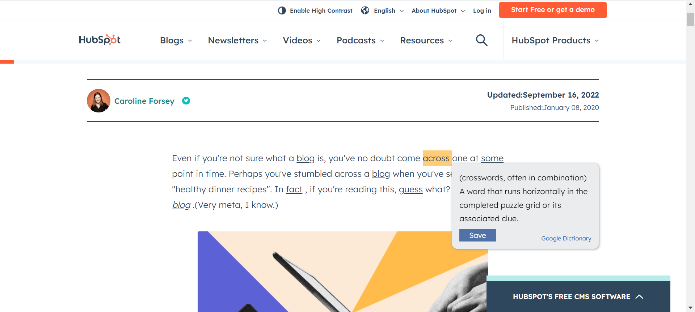
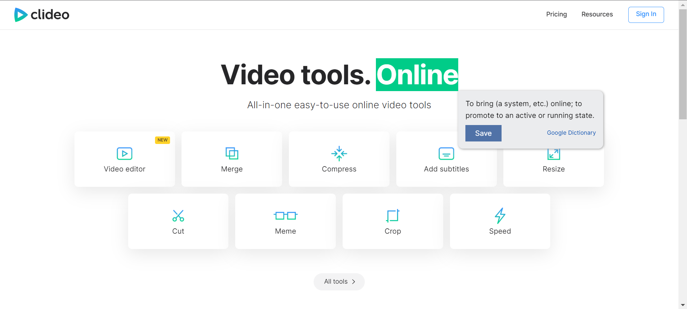
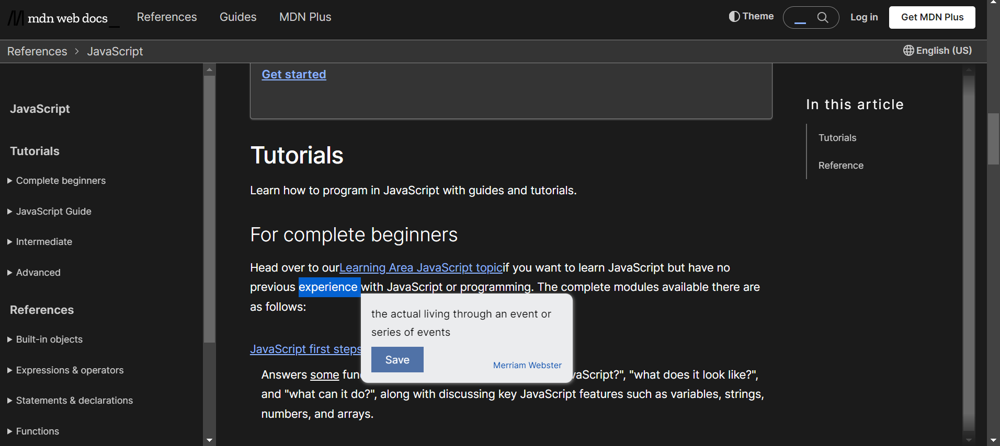
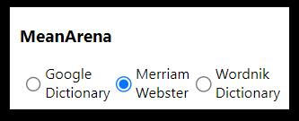
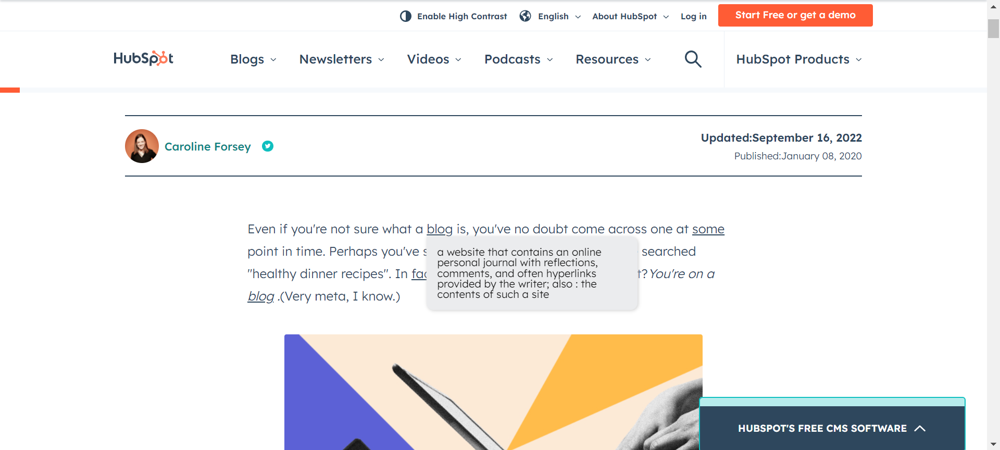

# MeanArena Chrome Extension

## Table of contents

- [Overview](#overview)
  - [Project](#project)
  - [Screenshot](#screenshot)
- [Process](#process)
  - [Working](#working)
  - [Built with](#built-with)
- [Author](#author)

## Overview

### Project

MeanArena Chrome Extension is a productivity look-up tool that allows to enhance comprehension of difficult words.

### Screenshot

## Process

### Working

- The user downloads the chrome extension.
-	After dwonloading, pin the chrome extension to the extension bar right beside the google search bar.
- MeanArena provides access to multiple dictionaries i.e. Google Dictionary, Merriam Webster, Wordnik Dictionary.
- Click on the extension icon to select your preferred dictionary.
- Double click on any word and the definition will be retrieved and displayed from the selected dicionary.
-	To save the words, click "save".
-	If the user is logged in to our MeanArena Website. The word along with its definition will be saved
-	Otherwise, the user is prompted to login or create an account.

### Built with

- Semantic HTML5 markup
- CSS custom properties
- Javascript
- PHP

## Author

[SumayyahSayyed]
